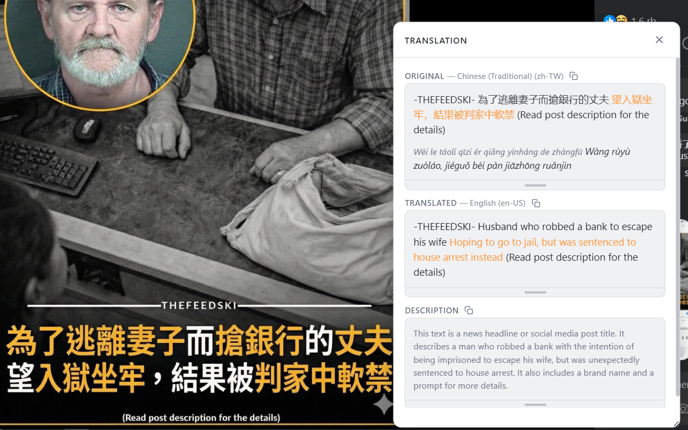
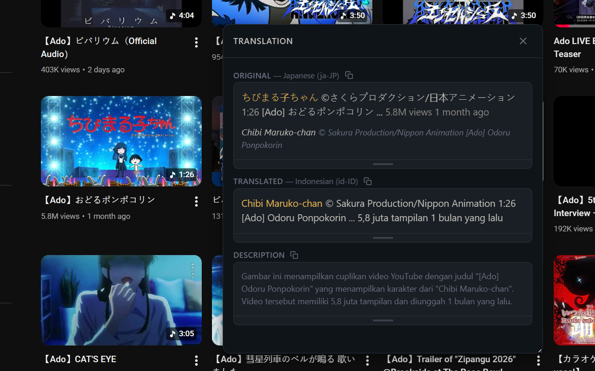
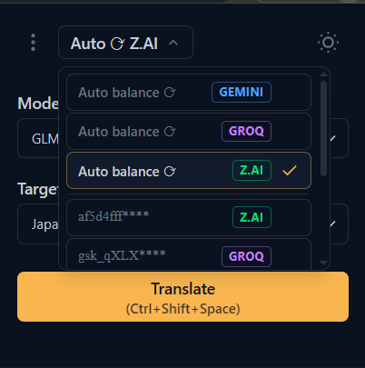

#  Rosseta

[](https://chromewebstore.google.com/detail/rosseta/flbdkalgeiekpnchpakdpaabcehpnlln) [](https://addons.mozilla.org/en-US/firefox/addon/rosseta/)

A browser extension that translates text from any region of a webpage. Select an area on screen, and the extension captures, extracts, and translates the text using AI — all without leaving the page.

_Named after the [Rosetta Stone](https://en.wikipedia.org/wiki/Rosetta_Stone) — the ancient artifact that unlocked the mystery of Egyptian hieroglyphs. Just as the stone bridged languages carved in stone, Rosseta bridges languages rendered on screen._

> Successor of [select-and-translate](https://github.com/apirJS/select-and-translate) — rebuilt from scratch with a proper architecture.

Built with **Svelte 5**, **TypeScript**, **Tailwind CSS v4**, and a **DDD + Hexagonal architecture**.

---

## Demo







---

## Features

- 🖱️ **Region select** — Draw a box on any part of a page, including images, and get an instant translation overlay with romanization
- 🤖 **Multi-provider** — Switch between Gemini and Groq models on the fly
- 🌍 **110+ languages** — [Gemini supports 110 languages](https://docs.cloud.google.com/vertex-ai/generative-ai/docs/models?hl=id#expandable-1), [Groq (Llama 4) supports 12](https://github.com/marketplace/models/azureml-meta/Llama-4-Scout-17B-16E-Instruct) — auto-filtered per provider
- 🔑 **Key management** — Multiple API keys per provider with auto-rotation
- 🌐 **Proxy support** — Route all API calls through your own relay server
- 📜 **History** — Every translation saved locally, searchable
- 🌙 **Dark mode** — System-aware with manual toggle

---

## Install

- **Chrome** — [Install from Chrome Web Store](https://chromewebstore.google.com/detail/rosseta/flbdkalgeiekpnchpakdpaabcehpnlln)
- **Firefox** — [Install from Firefox Add-ons](https://addons.mozilla.org/en-US/firefox/addon/rosseta/)

---

## Contributing

See [CONTRIBUTING.md](CONTRIBUTING.md) for setup instructions, architecture details, coding standards, and the pull request process.

---

## Proxy Setup (Optional)

Rosseta can route all API requests through a proxy server instead of calling the AI provider directly.

**Why use a proxy?**

- Your network blocks `generativelanguage.googleapis.com` or `api.groq.com`
- You want to hide your IP address from the API provider
- You need request logging, rate limiting, or caching on your own server

### How it works

The proxy URL **replaces the base URL** of the API. Rosseta appends the original path and query string to your proxy URL:

| Provider | Without proxy                                                                             | With proxy `https://my-proxy.com`                      |
| -------- | ----------------------------------------------------------------------------------------- | ------------------------------------------------------ |
| Gemini   | `https://generativelanguage.googleapis.com/v1beta/models/{model}:generateContent?key=...` | `https://my-proxy.com/{model}:generateContent?key=...` |
| Groq     | `https://api.groq.com/openai/v1/chat/completions`                                         | `https://my-proxy.com/chat/completions`                |

> **Important:** Your API key is still included in the request (as a query param for Gemini, as an `Authorization` header for Groq). Make sure you trust your proxy server.

### Configuration

1. Open the extension popup → **☰ menu** → **Proxy Settings**
2. Enter your proxy server URL
3. Click **Save** — a health check runs automatically
4. ✅ Connected = proxy is working, ✗ Unhealthy = proxy is unreachable (not saved)

To go back to direct connections, click **Clear**.

### Example: Cloudflare Worker

A minimal reverse proxy that forwards requests to the original API:

```js
// The path after your worker URL is the AI provider's path.
// Your proxy URL should be set to: https://your-worker.workers.dev/v1beta/models
// (for Gemini) or https://your-worker.workers.dev/openai/v1 (for Groq).

const PROVIDERS = {
  '/v1beta/': 'https://generativelanguage.googleapis.com',
  '/openai/': 'https://api.groq.com',
};

export default {
  async fetch(request) {
    const url = new URL(request.url);

    // Determine target based on path prefix
    let target;
    for (const [prefix, origin] of Object.entries(PROVIDERS)) {
      if (url.pathname.startsWith(prefix)) {
        target = origin;
        break;
      }
    }

    if (!target) {
      return new Response('Unknown provider path', { status: 400 });
    }

    return fetch(target + url.pathname + url.search, {
      method: request.method,
      headers: request.headers,
      body: request.body,
    });
  },
};
```

With this worker deployed at `https://your-worker.workers.dev`, set your proxy URL to `https://your-worker.workers.dev/v1beta/models` for Gemini or `https://your-worker.workers.dev/openai/v1` for Groq.

> **Tip:** Since both providers use different base URLs, you'll only be proxying whichever provider you configure. To proxy both, you'll need one proxy URL per provider — or a single proxy that inspects the path to determine the target (like the example above).

---

## Roadmap

- [x] Release to Chrome Web Store and Firefox Add-ons
- [ ] Add OpenRouter provider
- [x] Add proxy support
- [ ] Improve UI/UX

---

## Privacy

Rosseta does **not** collect, store, or transmit any personal data to our servers.

- **API keys**, **preferences**, and **translation history** are stored locally in your browser using `browser.storage.local` and never leave your device.
- **Translation requests** (screenshots of selected areas) are sent directly from your browser to the AI provider you configured (Google Gemini or Groq) using your own API key. We have no access to this data.
- **No analytics, tracking, or telemetry** of any kind.

---

## License

This project is licensed under the [MIT License](LICENSE).
