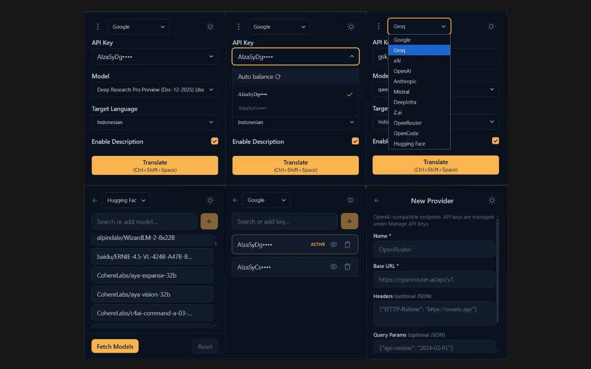
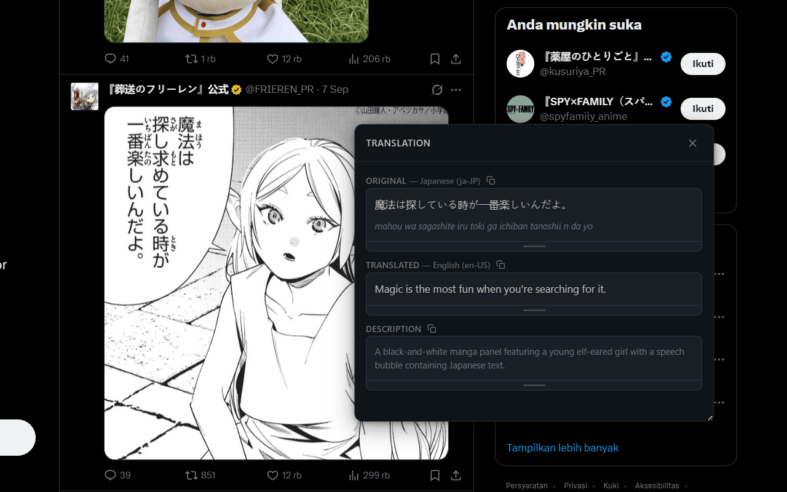
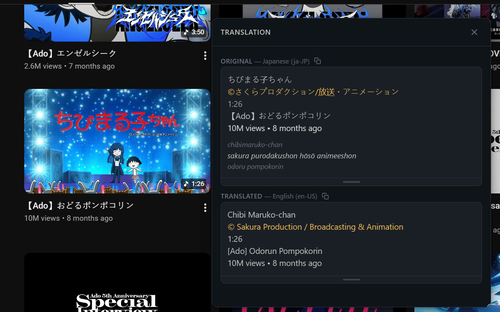
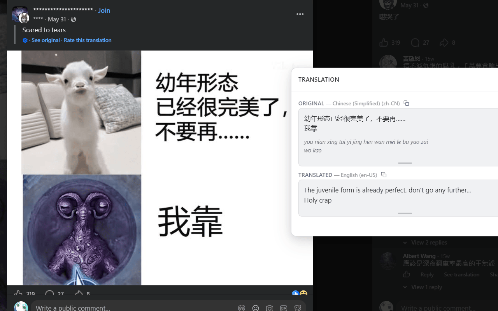

#  Rosseta

 

A browser extension that translates text from any region of a webpage. Draw a selection box over the text, images, or UI elements on screen. The extension captures that region as a screenshot, sends it to a vision LLM for OCR, and renders the translated text in an overlay on the page.

Named after the [Rosetta Stone](https://en.wikipedia.org/wiki/Rosetta_Stone). Successor of [select-and-translate](https://github.com/apirJS/select-and-translate), rebuilt from scratch.

---

## Demo

---

## Features

### Region-based translation

Select any area of a page by drawing a rectangle over it. This works on regular text, embedded images, video subtitles, UI labels, buttons, or anything else visible on screen. The extension screenshots the selected region, runs OCR through a vision model, segments the text by language, and displays both the original and translated text in an in-page modal.

### Romanization

For non-Latin scripts (Japanese, Chinese, Korean, Arabic, Thai, etc.), the translation result includes romanization alongside the original text. For example, Japanese text shows its reading in romaji.

### Context description

Each translation result can include a brief contextual summary describing what was captured. This is written in the target language. It can be turned off in settings to reduce token usage.

### Multi-segment output

The OCR output is segmented by visually distinct blocks, not merged into a single blob. Each heading, label, timestamp, button, and caption is its own segment with its own language tag and translation. Mixed-language text within a single block is split by language.

### 11 built-in AI providers

Rosseta supports the following providers out of the box: Google, Groq, xAI, OpenAI, Anthropic, Mistral, DeepInfra, Z.ai, OpenRouter, OpenCode, and Hugging Face.

Model lists are fetched directly from the provider's API at runtime. You can also add models manually.

### Custom OpenAI-compatible endpoints

Point Rosseta at any OpenAI-compatible API by providing a base URL, optional custom headers, and optional query parameters. Useful for self-hosted models, corporate proxies, or providers not yet built in.

### Multiple API keys per provider

You can store multiple API keys for each provider. The extension supports round-robin key rotation across keys for the same provider, cycling to the next key after each request.

### Translation history

Every translation is automatically saved locally. History is searchable and can be cleared individually or all at once.

### Keyboard shortcut

Default shortcut: `Ctrl+Shift+Y` (Windows/Linux) or `Cmd+Shift+Y` (macOS). This triggers the selection overlay directly without opening the popup. The shortcut is customizable through your browser's extension shortcut settings.

### Cross-browser

Runs on both Chrome and Firefox as a Manifest V3 extension.

---

## Install

- **Chrome**: [Install from Chrome Web Store](https://chromewebstore.google.com/detail/rosseta/flbdkalgeiekpnchpakdpaabcehpnlln)
- **Firefox**: [Install from Firefox Add-ons](https://addons.mozilla.org/en-US/firefox/addon/rosseta/)

---

## Tech stack

Built with Svelte 5 (runes), TypeScript (strict, no `any`), Tailwind CSS v4, and a DDD + Hexagonal (Ports & Adapters) architecture. Translation calls go through the Vercel AI SDK (`@ai-sdk/*`).

---

## Contributing

See [CONTRIBUTING.md](CONTRIBUTING.md) for setup instructions, architecture details, coding standards, and the pull request process.

---

## Roadmap

- [x] Release to Chrome Web Store and Firefox Add-ons
- [ ] More AI providers

---

## Known Issues
I forgot about thiss... (will fix this on 2.0.1)

- **Custom provider headers and query params are ignored when fetching models.** For a custom OpenAI-compatible endpoint, *Manage Models -> Fetch* sends only the base URL and API key, so endpoints that require extra headers (e.g. OpenRouter's `HTTP-Referer`) or query parameters (e.g. an `api-version`) may fail to list their models. Translation is unaffected.
- **Custom header and query param values are not validated.** Invalid header names, or values containing control characters such as newlines, are accepted when saving and only surface later as a generic request error.

Both are planned to be addressed in a follow-up release.

---

## Privacy

Rosseta does **not** collect, store, or transmit any personal data to our servers.

- **API keys**, **preferences**, and **translation history** are stored locally in your browser using `browser.storage.local` and never leave your device.
- **Translation requests** (screenshots of selected areas) are sent directly from your browser to the AI provider you configured, using your own API key. We have no access to this data.
- **No analytics, tracking, or telemetry** of any kind.

---

## License

This project is licensed under the [MIT License](LICENSE).
