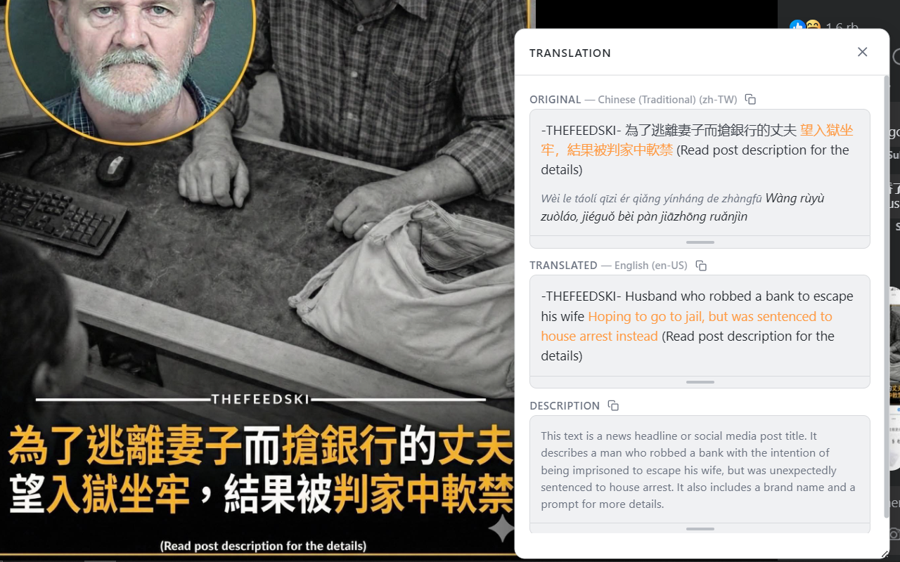
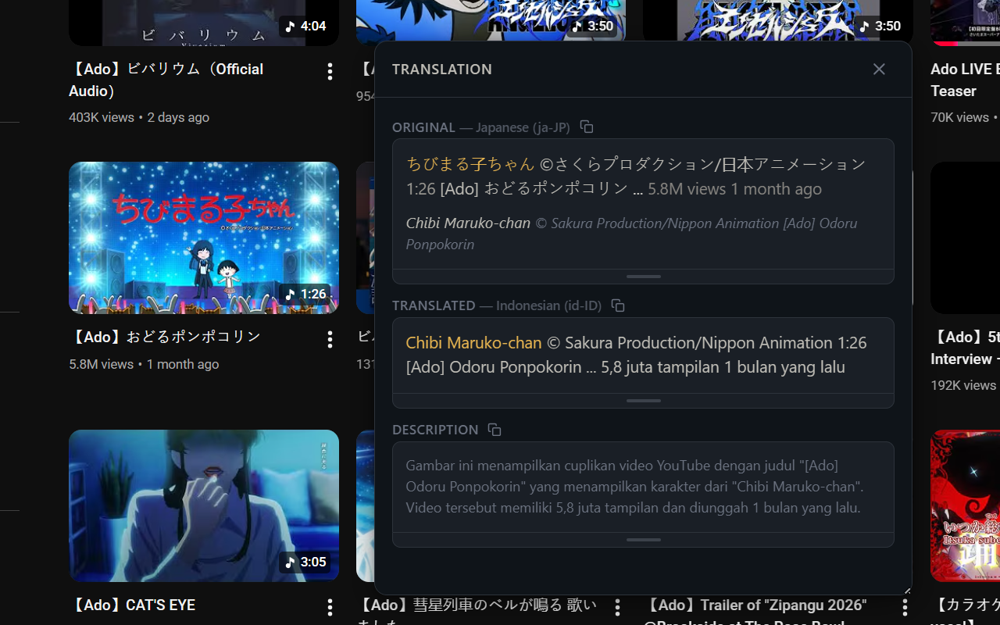
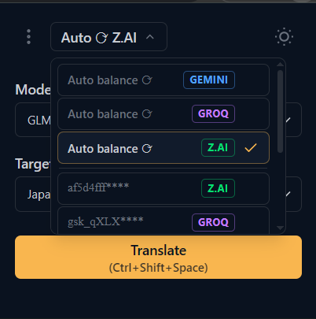

#  Rosseta

 

A browser extension that translates text from any region of a webpage. Select an area on screen, and the extension captures, extracts, and translates the text using AI — all without leaving the page.

_Named after the [Rosetta Stone](https://en.wikipedia.org/wiki/Rosetta_Stone) — the ancient artifact that unlocked the mystery of Egyptian hieroglyphs. Just as the stone bridged languages carved in stone, Rosseta bridges languages rendered on screen._

> Successor of [select-and-translate](https://github.com/apirJS/select-and-translate) — rebuilt from scratch with a proper architecture.

Built with **Svelte 5**, **TypeScript**, **Tailwind CSS v4**, and a **DDD + Hexagonal architecture**.

---

## Demo

**▶️ YouTube Demo: [COMING SOON](#)**

---

## Features

- 🖱️ **Region select** — Draw a box on any part of a page, including images, and get an instant translation overlay with romanization
- 🤖 **Multi-provider** — Google, Groq, xAI, OpenAI, Anthropic, Mistral, DeepInfra, and any OpenAI-compatible endpoint, with model lists fetched straight from the provider
- 🔑 **Key management** — Multiple API keys per provider with auto-rotation
- 🧩 **Custom endpoints** — Point Rosseta at any OpenAI-compatible API
- 📜 **History** — Every translation saved locally, searchable
- 🌙 **Dark mode** — System-aware with manual toggle

### Supported languages

The full language list is available regardless of provider. Most vision-capable models handle all of them; if the chosen model cannot serve a language, the provider's error is surfaced as a toast and you can switch models freely.

---

## Install

- **Chrome** — [Install from Chrome Web Store](https://chromewebstore.google.com/detail/rosseta/flbdkalgeiekpnchpakdpaabcehpnlln)
- **Firefox** — [Install from Firefox Add-ons](https://addons.mozilla.org/en-US/firefox/addon/rosseta/)

---

## Contributing

See [CONTRIBUTING.md](CONTRIBUTING.md) for setup instructions, architecture details, coding standards, and the pull request process.

---

## Roadmap

- [x] Release to Chrome Web Store and Firefox Add-ons
- [ ] Improve UI/UX

---

## Privacy

Rosseta does **not** collect, store, or transmit any personal data to our servers.

- **API keys**, **preferences**, and **translation history** are stored locally in your browser using `browser.storage.local` and never leave your device.
- **Translation requests** (screenshots of selected areas) are sent directly from your browser to the AI provider you configured, using your own API key. We have no access to this data.
- **No analytics, tracking, or telemetry** of any kind.

---

## License

This project is licensed under the [MIT License](LICENSE).
